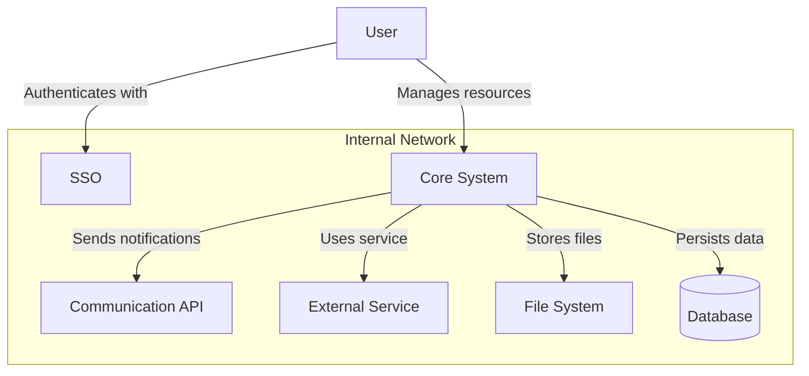
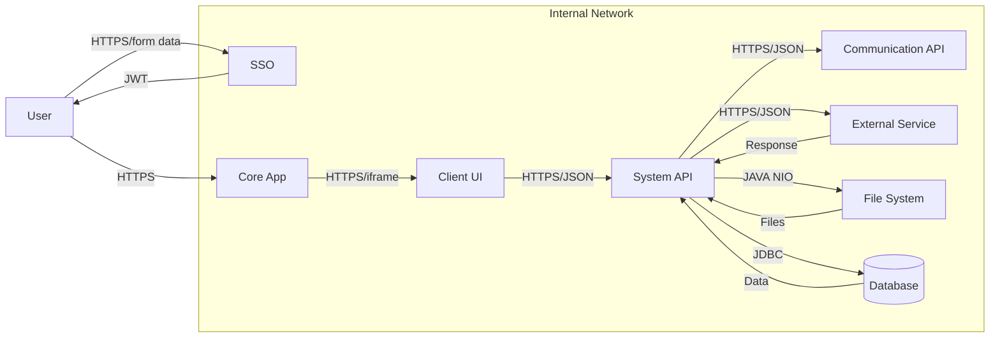

# 2. Context

## 2.1 Business Context

This section outlines the key actors and external systems that interact with the
**[System Name]**. It describes the primary communication pathways and the business purpose
of each interaction.

| System/Actor           | Interaction Description                                                                                 |
|------------------------|---------------------------------------------------------------------------------------------------------|
| **User**               | End-users interact with the system to manage resources.                                                 |
| **SSO**                | The system for allowing access to different applications.                                               |
| **Core System**        | The core system for managing business logic.                                                            |
| **Communication API**  | The API responsible for sending notifications.                                        |
| **External Service**   | An external service used for specific functionality.                                                   |
| **File System**        | A storage system for persisting files.                                                                  |
| **Database**           | A relational database for storing application data.                                                     |

## 2.2 Technical Context

This section details the technical interfaces, protocols, and data formats used for communication
between the **[System Name]** and its external dependencies.

| System/Actor          | Interaction Description                                                                                 |
|-----------------------|---------------------------------------------------------------------------------------------------------|
| **User**              | End-users interact with the system.                                                                     |
| **SSO**               | The system for allow access to different applications.                                                  |
| **Core App**          | The primary user-facing application.                                                                    |
| **Client UI**         | The UI component that allows users to interact with the **[System Name]**.                          |
| **[System Name]**     | The core backend service that receives HTTP requests, JWT Authorized in JSON format.                    |
| **Communication API** | The Communication API receives HTTP requests, JWT Authorized in JSON format.                            |
| **External Service**  | The External Service receives HTTP requests, JWT Authorized in JSON format.                                      |
| **File System**       | A storage solution for persisting files to a shared directory using the Java NIO library.               |
| **Database**          | A relational database that maintains data persistence via a JDBC driver.                                |

## 2.3 Glossary

For more detailed information about the business, you can consult
a [glossary](../domain/glossary.md) which compiles all the most relevant terms of the domain
model along with their meaning. This glossary must serve as the vocabulary for all stakeholders, who
must adhere to it mandatory.
