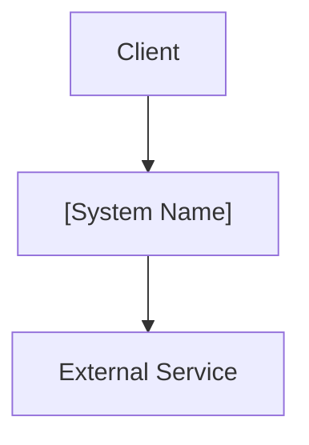
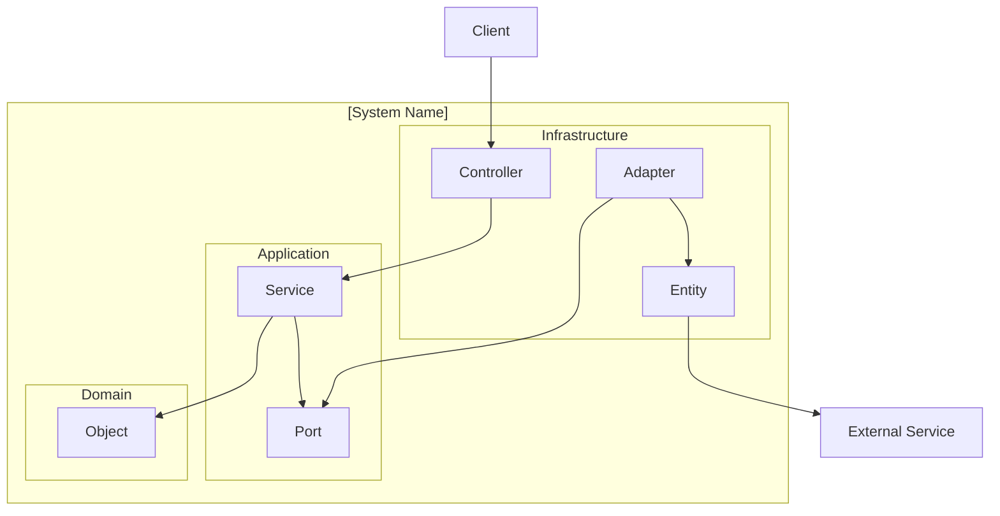
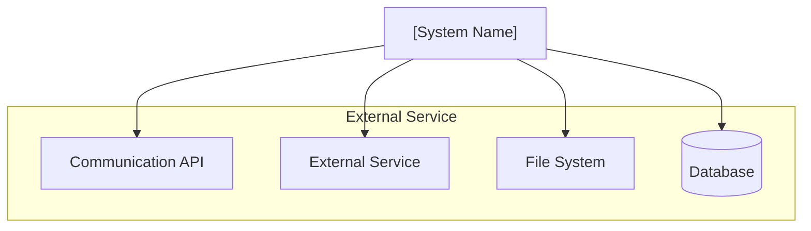
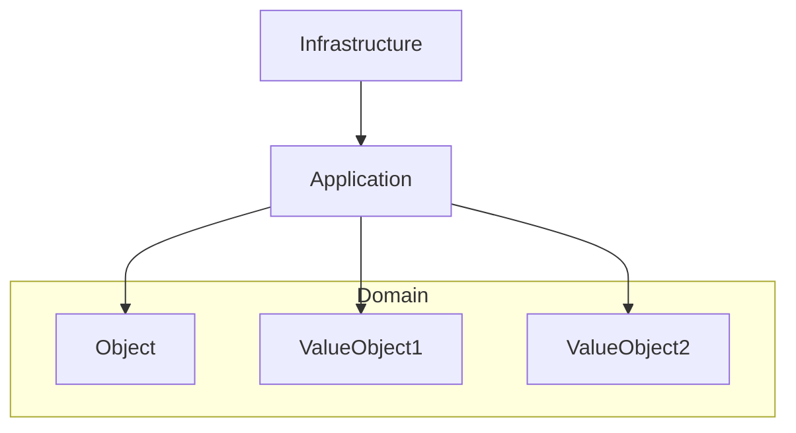
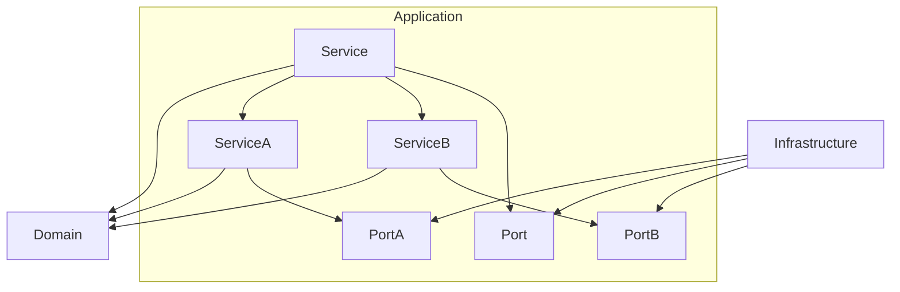
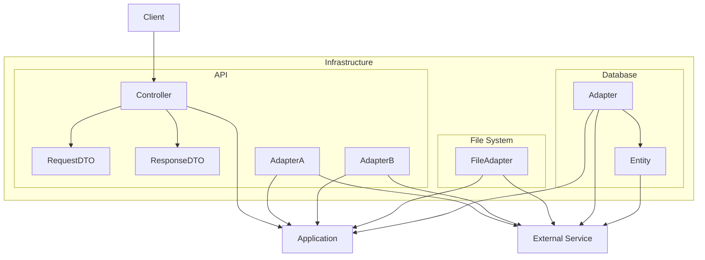

# 3. Building Block View

The building block view ranges from the scope & context down to very specific and low-level-3 (
code).

## 3.1 Overall System

| Building Block       | Description                                                                                                                                                       |
|:---------------------|:------------------------------------------------------------------------------------------------------------------------------------------------------------------|
| **Client**           | The client application that interacts with the system through a REST API.                                                                                                              |
| **[System Name]** | The backend functionality for the Core Application.                                                                                                               |
| **External Service** | Any external dependency, such as other APIs, databases, or file systems, that the **[System Name]** interacts with to fulfill its responsibilities. |

## 3.2 [System Name] - Level 1

| Building Block     | Description                                                                                                                                                                                        |
|:-------------------|:---------------------------------------------------------------------------------------------------------------------------------------------------------------------------------------------------|
| **Infrastructure** | The infrastructure module contains all the necessary components to support the application and domain layers, including external API clients, database integrations, and file system interactions. |
| **Application**    | The application module contains the business logic and orchestrates interactions between the domain and infrastructure layers.                                                                     |
| **Domain**         | The domain module contains the core business entities and rules, independent of any specific application or infrastructure concerns.                                                               |

### 3.2.1 Rationale:

This level further decomposes the `[System Name]` into its primary components, illustrating
the flow of control and data between them.

It highlights the separation of concerns within each layer (Domain, Application, Infrastructure) and
how they collaborate to fulfill business requirements.

The use of interfaces in the application layer and their implementations in the infrastructure layer adheres to the
Dependency Inversion Principle, promoting a flexible and testable design.

## 3.3 External Service - Level 1

| Building Block        | Description                                                 |
|:----------------------|:------------------------------------------------------------|
| **Communication API** | An external service used for communication. |
| **External Service**  | An external service used for specific functionality.      |
| **File System**       | A storage system for persisting files.                      |
| **Database**          | A relational database for storing application data.         |

## 3.4 Domain - Level 2

| Building Block     | Description                                                                                                                                                                                        |
|:-------------------|:---------------------------------------------------------------------------------------------------------------------------------------------------------------------------------------------------|
| **Application**    | The application module contains the business logic and orchestrates interactions between the domain and infrastructure layers.                                                                     |
| **Infrastructure** | The infrastructure module contains all the necessary components to support the application and domain layers, including external API clients, database integrations, and file system interactions. |
| **Object**   | The `Object` is the domain entity containing the business logic.                                                                                                                    |
| **ValueObject1**   | A value object representing a specific concept.                                                                                                             |
| **ValueObject2**   | A value object representing another concept.                                                                                                                  |

## 3.5 Application Layer - Level 2

| Building Block          | Description                                                                                                              |
|:------------------------|:-------------------------------------------------------------------------------------------------------------------------|
| **Service**             | The `Service` orchestrates the operations, coordinating between data access and other services. |
| **Port**         | The `Port` is an interface defining the contract for data access operations.                     |
| **ServiceA**            | The `ServiceA` handles operations related to specific functionality A.                                                         |
| **PortA**               | The `PortA` is an interface defining the contract for external interactions.                                    |
| **ServiceB**            | The `ServiceB` orchestrates the operations for specific functionality B.                                                         |
| **PortB**               | The `PortB` is an interface defining the contract for interacting with external service B.                    |

### 3.5.1 Rationale:

This level further decomposes the `[System Name]` into its primary components, illustrating
the flow of control and data between them. It highlights the separation of concerns within each
layer (Domain, Application, Infrastructure) and how they collaborate to fulfill business
requirements. The use of interfaces in the application layer and their implementations in the
infrastructure layer adheres to the Dependency Inversion Principle, promoting a flexible and testable design.

## 3.6 Infrastructure Layer - Level 2

| Building Block              | Description                                                                                                                                                       |
|:----------------------------|:------------------------------------------------------------------------------------------------------------------------------------------------------------------|
| **User**                    | End-users interact with the system indirectly through the frontend.                                                                                               |
| **Application**             | The application module contains the business logic and orchestrates interactions between the domain and infrastructure layers.                                    |
| **External Service**        | Represents any external dependency, such as other APIs, databases, or file systems, that the **[System Name]** interacts with to fulfill its responsibilities. |
| **Controller**              | The `Controller` handles incoming HTTP requests, acting as the entry point for the API.                                    |
| **RequestDTO**              | The `RequestDTO` represents the data transfer object (DTO) for incoming requests.                                             |
| **ResponseDTO**             | The `ResponseDTO` represents the data transfer object (DTO) for outgoing responses.                                          |
| **FileAdapter**             | The `FileAdapter` is the implementation of `Port` that interacts with the file system using a specific technology.                                      |
| **AdapterA**                | The `AdapterA` is the implementation of `PortA` that communicates with the external API using a specific technology.                           |
| **AdapterB**                | The `AdapterB` is the implementation of `PortB` that communicates with the external API using a specific technology.                   |
| **Adapter**         | The `Adapter` is the implementation of `Port` that interacts with the database using a specific technology.                        |
| **Entity**                  | The `Entity` is the JPA entity that maps the domain object to the database.                                                                    |

## 3.7. Naming convention

For more information about the naming of the architecture's components, you can consult the [naming
convention](appendices/naming-convention.md) in the appendices.

## 3.8. Architecture test

Unit tests should be run to ensure that the application code follows architectural convention. The
tool for testing the architectural layers and naming conventions
is [ArchUnit](https://www.archunit.org/).
