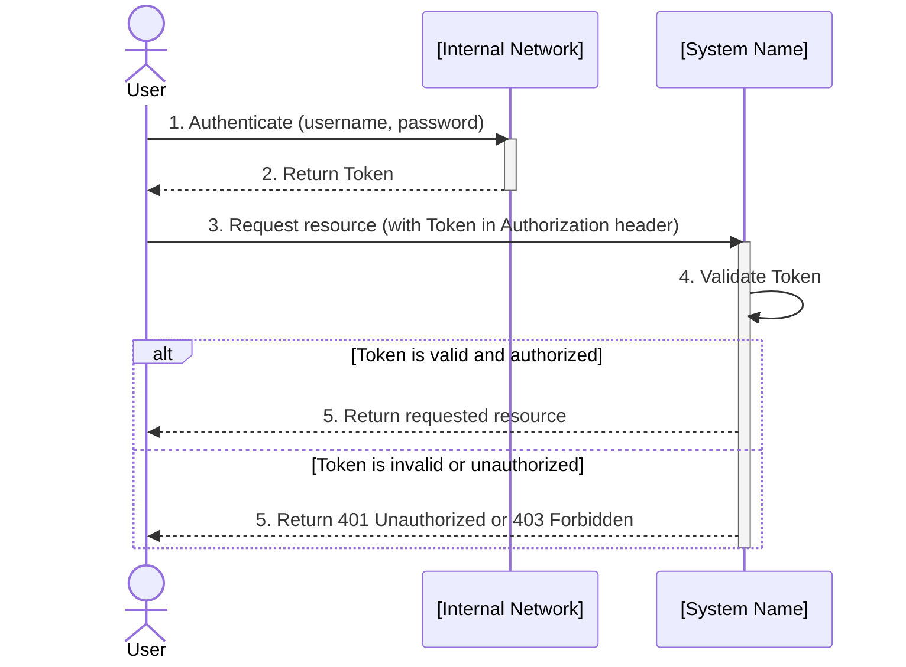

# 4. Runtime View

The runtime view describes concrete behavior and interactions of the system’s building blocks in
form of scenarios.

## 4.1. Feature: [Feature Name]

These scenarios describe the interactions for the [feature] of the application.

### 4.1.1. Scenario: [Scenario Name]

