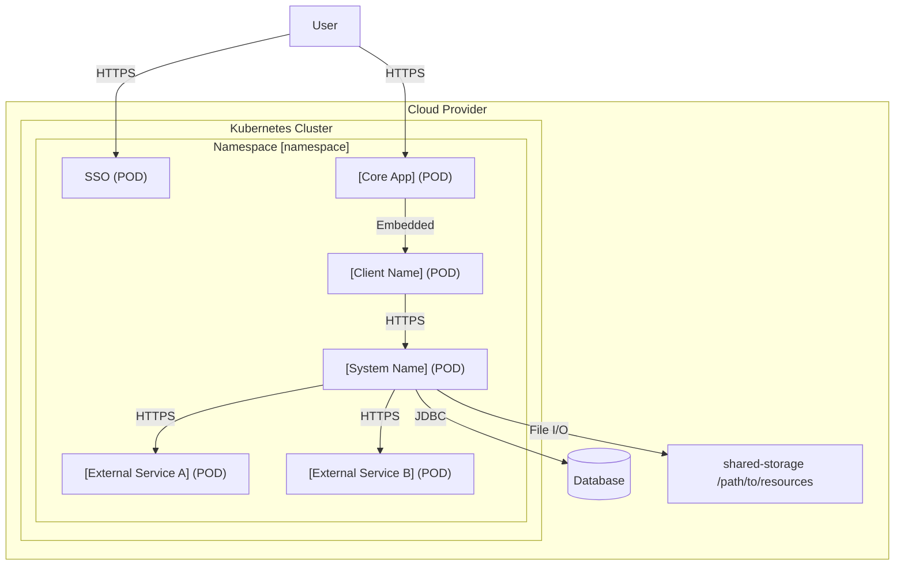
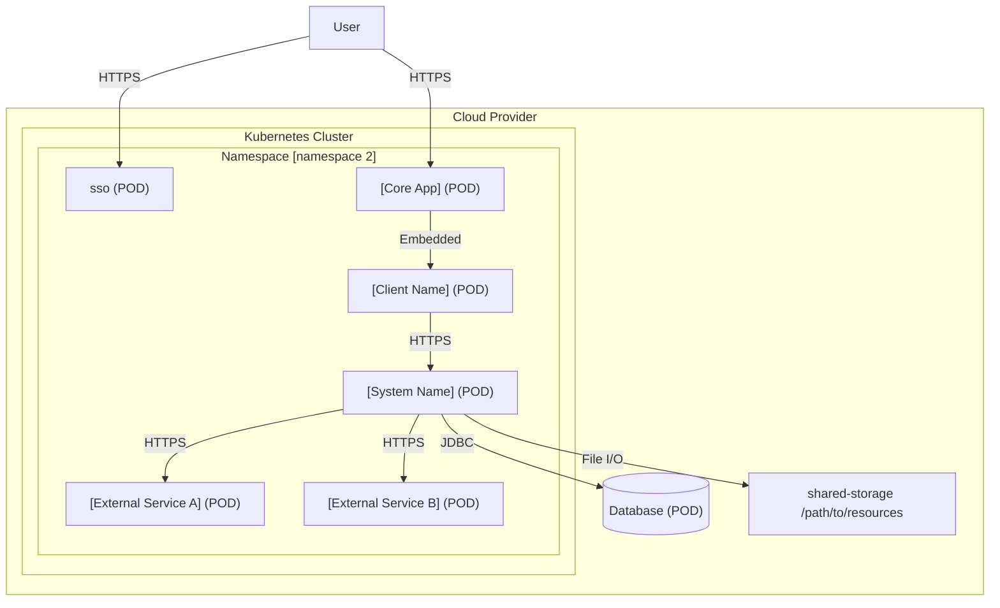

# 5. Deployment View

## 5.1 [Environment Name] environment

### Motivation

The [Environment Name] environment diagram illustrates the deployment of the `[System Name]` application
and its dependencies within the Kubernetes Cluster, specifically in the `[namespace]`
namespace.

### Mapping

| Node                     | Description                             |                                                                                                                
|:-------------------------|:----------------------------------------|
| sso (POD)                | POD for `SSO` application.              |
| core_app (POD)           | POD for `[Core App]` application.         |
| client (POD)             | POD for `[Client Name]` application.|
| system (POD)             | POD for `[System Name]` application.|
| service_a (POD)          | POD for `[External Service A]` application.          |
| service_b (POD)          | POD for `[External Service B]` application.          |
| db (POD)           | Database.                               |                         
| volume_shared           | Mounted shared folder.                  |

## 5.2 [Environment Name 2] environment

### Motivation

The [Environment Name 2] environment diagram illustrates the deployment of the `[System Name]`
application and its dependencies within the Kubernetes Cluster, specifically in the
`[namespace 2]` namespace.

### Mapping

| Node                     | Description                             |                                                                                                                
|:-------------------------|:----------------------------------------|
| sso (POD)                | POD for `SSO` application.              |
| core_app (POD)           | POD for `[Core App]` application.         |
| client (POD)             | POD for `[Client Name]` application.|
| system (POD)             | POD for `[System Name]` application.|
| service_a (POD)          | POD for `[External Service A]` application.          |
| service_b (POD)          | POD for `[External Service B]` application.          |
| Database (POD)           | Database.                               |                         
| shared-storage           | Mounted shared folder.                  |
