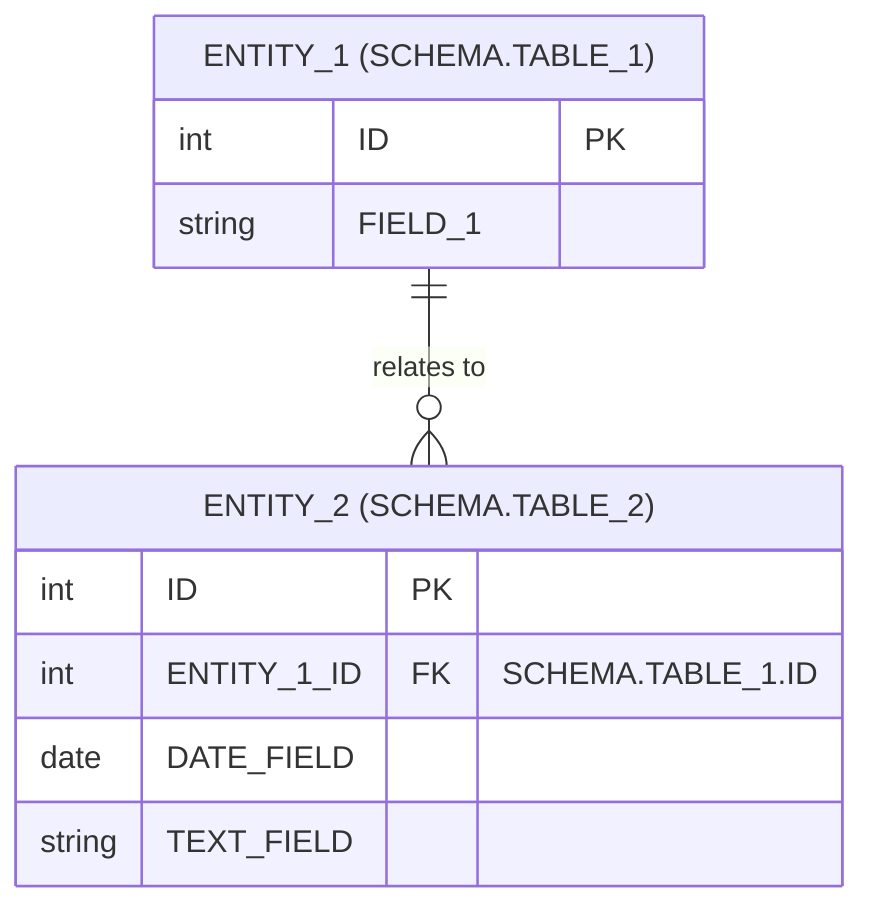

# Entity relationship model (ER)

This ER diagram outlines the relationships between various entities involved in the system.

> Notes: not all table and columns are represented here only basics

# Main Entities

